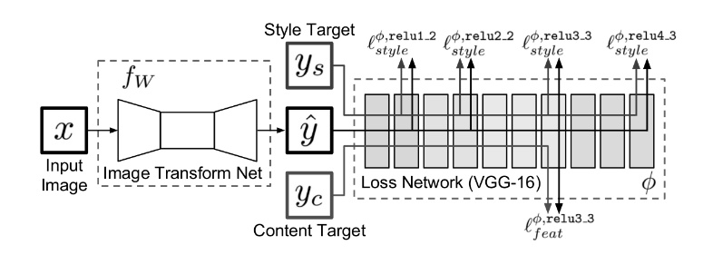
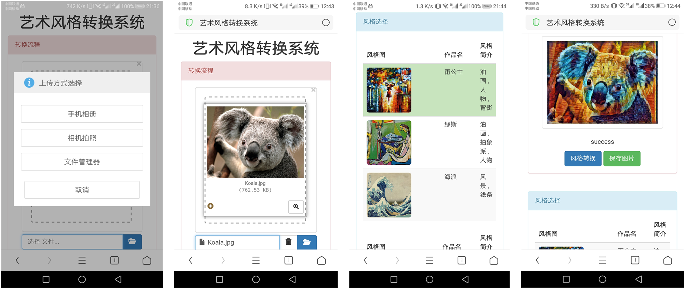
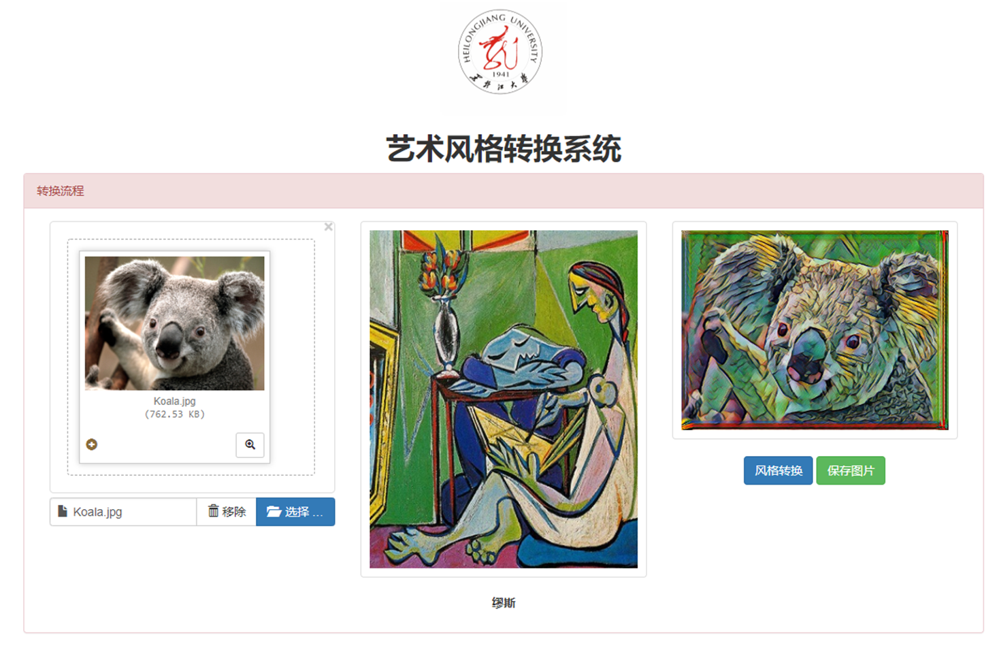
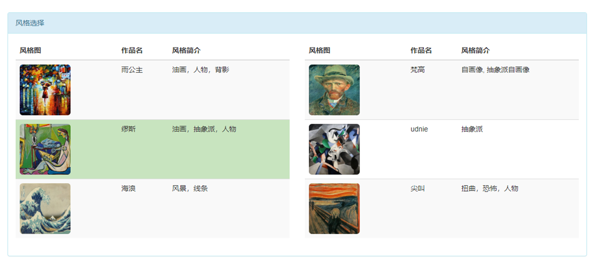

# style_transfer
# 图像迁移， style transfer

本项目为论文 https://arxiv.org/pdf/1603.08155.pdf 的Tensorflow实现，并且增加了友好的操作界面，无论是通过手机或是PC端浏览器均可以很好的得到风格迁移的图片。

## 需求

- python3.x
- tensorflow

## 运行

> python manager.py runserver
>
> 然后用浏览器打开http://127.0.0.1:8000/style_transfer/ 即可使用

## 网络结构图

## 手机端界面

## PC端界面

